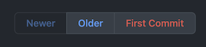

# GitHub First Commit

While browsing the commit log, display a button to the page with the very first
commit.

## Setup

This extension is currently only available as unpacked. To install, clone the repository and in

### Chrome

* In the address bar, enter `chrome://extensions`
* Enable Developer Mode and switch into it
* Click the `Load unpacked` button and select the extension directory

### Firefox

* In the address bar, enter `about:debugging#/runtime/this-firefox`
* Click the `Load Temporary Add-on` option and choose `manifest.json`

## Resources

* [Manifest v3](https://developer.chrome.com/docs/extensions/mv3/intro/)
